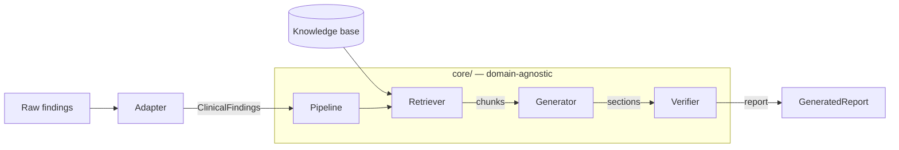

# Clinical RAG Workflow

[](https://github.com/jplgarin/clinical-rag-workflow/actions/workflows/ci.yml)
[](LICENSE)
[](pyproject.toml)

A retrieval-augmented pipeline for turning structured clinical findings into a
readable, **evidence-grounded** report, with a hard line between the generic
core and any single clinical domain.

The core idea: the core knows how to retrieve, write, and fact-check. It
knows nothing about EEG, lab panels, or imaging. A small **adapter** supplies
that knowledge. Add a domain by writing one class and dropping some text files
in a folder. You never touch `core/`.

> This is decision-support tooling, not a medical device. Do not use it to
> diagnose or treat anyone.

## Background

Clinical report generation tools tend to be built around a single domain and
resist extension. This project started from a different assumption: the
retrieval, generation, and verification steps are the same regardless of whether
the input is a lab panel, a cardiology summary, or an imaging result. The
domain-specific logic is small enough to live in one class. So that is where it
lives.

## Why it is built this way

Most report generation projects hardwire one domain into the prompt and call it
a day. That does not survive contact with a second domain. Here the contract is
explicit (`BaseAdapter`), generation is grounded in retrieved passages, and a
verification pass flags any sentence the evidence does not support, so a
confident-sounding hallucination shows up as a warning instead of slipping into
the report.

## Architecture



The adapter is the only domain-aware box. Everything inside `Core` is reused
unchanged across domains. See [docs/architecture.md](docs/architecture.md) for
the full walk-through.

## Features

- **Domain-agnostic core.** One `BaseAdapter` interface; the pipeline depends on
  nothing else.
- **Local retrieval.** sentence-transformers embeddings (downloaded once on first
  run, then fully local) and brute-force cosine search. No vector database, no
  per-request embedding API.
- **Claude-backed generation.** Uses the official Anthropic SDK to talk to
  Claude directly; the model is configurable via one env var.
- **Hallucination guard.** Claims are checked against the retrieved evidence;
  unsupported ones become report warnings and pull down confidence.
- **HTTP API + web UI.** FastAPI service with a dependency-free dark-mode
  frontend.
- **Worked example.** A full ADHD/EEG adapter (`examples/adhd_neuraxis`) with a
  real knowledge base.

## Quickstart

```bash
git clone https://github.com/jplgarin/clinical-rag-workflow.git
cd clinical-rag-workflow
pip install -r requirements.txt && pip install -e ".[dev]"
cp .env.example .env            # then set ANTHROPIC_API_KEY
uvicorn api.main:app --reload   # UI at http://localhost:8000/app
```

Run the tests (no API key or network needed, everything external is mocked):

```bash
pytest
```

## Building an adapter

An adapter maps your raw payload onto the generic schema and names the report.
That is the whole job:

```python
from pathlib import Path
from adapters.base import BaseAdapter
from core.schema import ClinicalFinding, ClinicalFindings


class LabPanelAdapter(BaseAdapter):
    def get_domain(self) -> str:
        return "lab_panel"

    def get_knowledge_base_path(self) -> Path:
        return Path(__file__).parent / "knowledge"

    def format_findings(self, raw: dict) -> ClinicalFindings:
        findings = [
            ClinicalFinding(
                name=item["name"],
                value=item["value"],
                unit=item.get("unit"),
                reference_range=item.get("reference_range"),
                status=item.get("status", "normal"),
                # status: "normal" | "borderline" | "abnormal" | "critical"
            )
            for item in raw["findings"]
        ]
        return ClinicalFindings(domain=self.get_domain(), findings=findings)

    def get_report_sections(self) -> list[str]:
        return ["Summary", "Interpretation", "Recommendations"]

    def get_prompt_templates(self) -> dict[str, str]:
        return {s: "{findings}\n\n{evidence}\n\nWrite the '%s' section." % s
                for s in self.get_report_sections()}

    def get_report_metadata(self) -> dict[str, str]:
        return {"display_name": "Lab Panel"}
```

Register it, hand it some `.txt` knowledge, and you have a new domain. The full
guide with testing is in [docs/adapters.md](docs/adapters.md).

## API reference

Interactive OpenAPI docs are served at `/docs` when the app is running. The
three endpoints:

| Method | Path             | Purpose                                  |
|--------|------------------|------------------------------------------|
| GET    | `/api/health`    | Status, loaded domains, version          |
| GET    | `/api/domains`   | Registered adapters and their sections   |
| POST   | `/api/generate`  | Generate a verified report for a domain  |

## Project layout

```
core/        domain-agnostic schema, retriever, generator, verifier, pipeline
adapters/    the BaseAdapter contract
api/         FastAPI app, routes, request/response models
web/          dark-mode frontend (no framework)
examples/    adhd_neuraxis (full adapter) and a generic starter payload
docs/         architecture, quickstart, adapters guide
tests/        unit + integration, externals mocked
```

## Contributing

Issues and PRs are welcome. Before opening a PR:

```bash
flake8 .
mypy
pytest
```

Keep the core domain-agnostic. If a change needs to know about a specific
clinical domain, it belongs in an adapter, not in `core/`.

## License

MIT. See [LICENSE](LICENSE).
