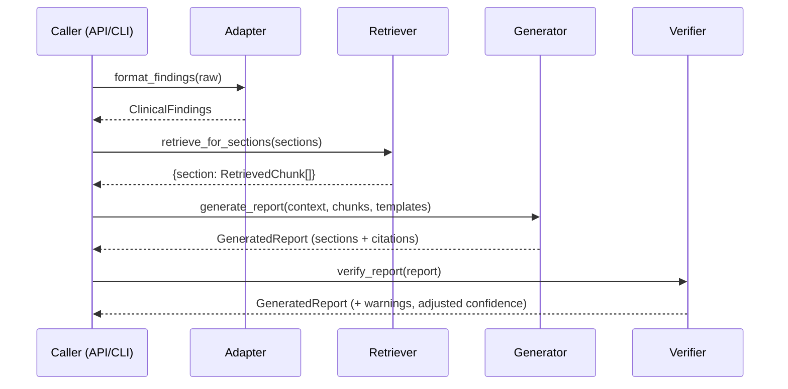

# Architecture

This document explains how the pieces fit together and why the boundaries are
drawn where they are.

## The one rule

`core/` never imports an adapter and never names a clinical domain. Everything
domain-specific lives behind the `BaseAdapter` interface. If you can keep that
rule, adding a domain stays a matter of writing one class plus a folder of text.

## Components

| Module | Responsibility |
|--------|----------------|
| `core/schema.py` | Pydantic models that every layer speaks. The lingua franca. |
| `adapters/base.py` | The `BaseAdapter` contract: the only seam between core and a domain. |
| `core/retriever.py` | Embedding, indexing, and cosine search over text knowledge bases. |
| `core/generator.py` | Prompt assembly and the call to an OpenAI-compatible LLM. |
| `core/verifier.py` | Claim-level grounding check against the retrieved evidence. |
| `core/pipeline.py` | Orchestration. Wires the four stages and logs each hand-off. |
| `api/` | FastAPI service and the adapter registry. |

## Data flow

Concretely, `ClinicalReportPipeline.run` does this:

1. **Format.** The adapter turns the raw vendor payload into `ClinicalFindings`.
   This is the only step that understands the input shape.
2. **Retrieve.** Each report section title is used as a query against the
   domain's vector stores. Results are deduplicated by chunk id and ranked.
3. **Generate.** For every section, the generator builds a prompt from the
   findings, patient context, and retrieved evidence, then asks the LLM for a
   body with inline `[n]` citations.
4. **Verify.** Each section is split into sentence-level claims. A claim is
   "supported" when it overlaps a retrieved chunk lexically (with an optional
   embedding fallback). Unsupported claims become report warnings and lower the
   section and overall confidence.

## Design decisions

**Retrieval is local and dependency-light.** For a few hundred chunks per
domain, a numpy matrix plus brute-force cosine is faster to reason about than a
vector database and removes an external service from the deployment. If a corpus
grows past what fits comfortably in memory, swapping in an ANN index is a
contained change inside `VectorStore`.

**Generation is provider-agnostic.** The generator speaks the OpenAI
chat-completions wire format because nearly every hosted and self-hosted server
exposes it. Point `LLM_API_BASE` wherever you like. The `LLMClient` is injectable
so tests pass a fake and never hit the network.

**Verification is intentionally simple.** Lexical overlap with an optional
semantic fallback will not catch every subtle misstatement, but it reliably
flags claims with no grounding at all, which is the failure mode that matters
most for a clinical report. It is explainable and cheap, and it degrades to
pure-lexical when no embedder is supplied.

**The schema is the contract.** Every layer depends on `core/schema.py` and
nothing reaches around it. That is what lets the API wrap the models for the
wire without the core knowing the API exists, and what keeps adapters honest.

## Failure behavior

- An unknown domain at the API returns `404`; an adapter or generator error
  returns `422` with the message, rather than a `500`.
- A missing knowledge path is logged and the domain still registers (it just
  retrieves nothing), so one misconfigured domain does not take down the service.
- A section with no matching prompt template falls back to a generic template
  instead of raising.
